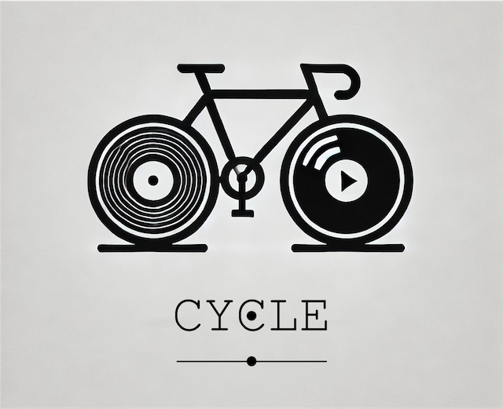

# Cycle

Recycle your workflows.



<!-- TODO: Add badges. -->

## References

The Computer Use for MacOS implementation is inspired by [PallavAg's Claude Computer Use Demo for MacOS](https://github.com/PallavAg/claude-computer-use-macos), and the [Antrophic quickstart guide](https://github.com/anthropics/anthropic-quickstarts/tree/main/computer-use-demo/computer_use_demo).

## How

Generative Process Automation:

1. Record a workflow with macOS Screen Recording.
1. Process the video to generate instructions.
1. Use computer use to playback the recording,
   combined with a custom instruction.

## Getting Started

Set up a virtual environment:

```shell
brew install python-tk

python3 -m venv venv
source venv/bin/activate
make install_dev
```

## Roadmap

- [ ] Edit transcripts.
- [ ] PyQT6 GUI.
- [ ] Integrate with MCP and Agent Protocols.
- [ ] Make foundation model independent.
- [ ] Go beyond macOS.
